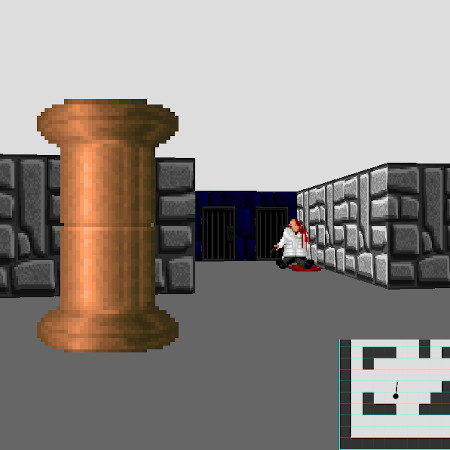

# Rayblasting


## A browser based retro FPS


> Written object-oriented in HTML, CSS (SASS), JavaScript (ES6+) and PHP

### Requirements
* A web browser (Firefox, Chrome, Opera, IE)
* NodeJS

### How to build

``` bash
npm i #Install dependencies:
gulp #Where the magic happens
```

**When built, there will appear a directory named `dist`**, containing all processed files. **ES6 will be converted using Babel JS to be backwards-, and therefore browser compatible.**  _Upload the directory to a web server of your choice to start playing._

### Engine features
* Walls
* Static objects
* Touch controls

### Libraries used
* [nippleJS](https://yoannmoi.net/nipplejs/) by Yoann Moinet
* [MainLoop.js](https://github.com/IceCreamYou/MainLoop.js) by Isaac Sukin